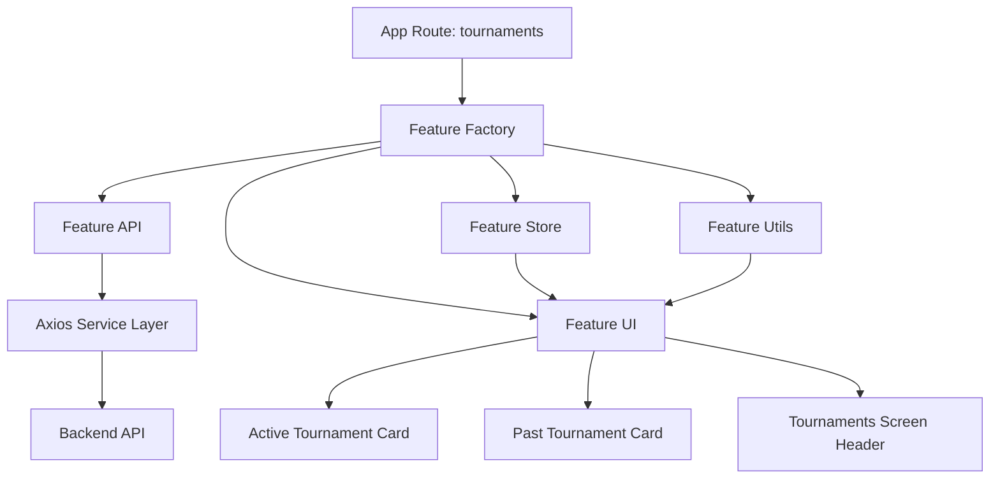
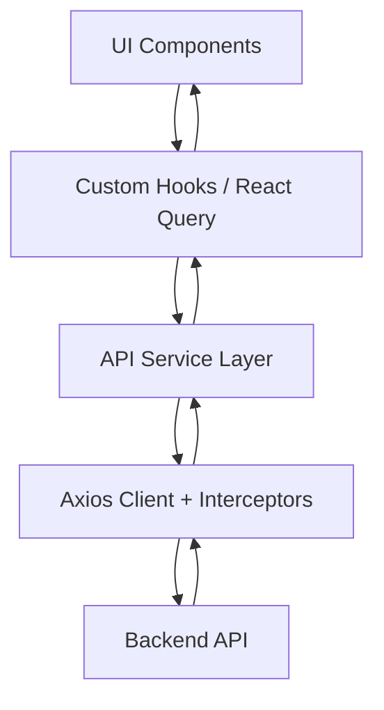

# Welcome to your Expo app 👋

This is an [Expo](https://expo.dev) project created with [`create-expo-app`](https://www.npmjs.com/package/create-expo-app).

## AM-Arena Frontend Architectural Handbook

This repository contains the mobile frontend for AM-Arena, built with Expo, Expo Router, React Native, TypeScript, React Query, and Zustand. The codebase is organized as a feature-driven application with a clear separation between composition, reusable UI, API access, server-state management, and feature-local state.

## Architecture Overview

The frontend follows a layered approach that keeps UI, data access, and state management separate:

- Route layer: `src/app` defines navigation entrypoints and screen composition.
- Feature layer: `src/features` groups the screen logic, local stores, UI fragments, and feature-specific helpers.
- Shared component layer: `src/components` contains reusable layout, top bar, bottom nav, motion, and notification building blocks.
- API layer: `src/api` centralizes Axios, service functions, response parsing, and transport concerns.
- State layer: `src/stores` holds app-wide Zustand stores, while feature-local mirror stores keep feature state isolated.

This structure keeps screens thin, makes data flow explicit, and allows features to evolve independently.

## Component Hierarchy And Layering

The app uses a composition-root pattern in [src/app/_layout.tsx](src/app/_layout.tsx). That file wires the global providers and application shell in one place:

- `QueryClientProvider` for server-state caching and invalidation
- `AuthBootstrap` for session initialization
- `ToastHost` for global notifications
- `KeyboardProvider` and `GestureHandlerRootView` for mobile interaction support
- `Stack` navigation for route registration

Route files are intentionally thin. They act as entrypoints that hand off to feature modules instead of containing complex logic.

### Feature Layering Pattern

Most complex screens follow the same pattern:

```text
app route -> feature factory -> feature api -> feature utils/state -> feature ui
```

For example, the tournaments feature is split across:

- `src/features/tournaments/factory.tsx`
- `src/features/tournaments/api.tsx`
- `src/features/tournaments/utils.tsx`
- `src/features/tournaments/store/*`
- `src/features/tournaments/ui.tsx`

This pattern keeps rendering concerns separate from data loading and derived state.

### Reusable UI Shell

Shared shell components provide consistency across screens:

- `src/components/layout/AppLayout.tsx`
- `src/components/layout/TabBarShell.tsx`
- `src/components/layout/KeyboardAwareScreenScrollView.tsx`
- `src/components/TopBar/ui/LoggedInTopBar.tsx`
- `src/components/BottomNav/ui/BottomNav.tsx`

These components prevent repeated screen chrome and keep navigation behavior consistent.

## Data Access Pattern

The frontend uses a two-step API model:

1. Transport and normalization live in `src/api`.
2. Consumption happens through React Query hooks in `src/hooks/api`.

### Axios Service Layer

The shared Axios client is defined in [src/api/axios/axiosInstance.ts](src/api/axios/axiosInstance.ts). It configures:

- a shared base URL
- credentials handling
- request and response interceptors
- platform-specific headers for native clients

The service functions under `src/api/services` call this client and parse the backend envelope before the data reaches the UI.

Example:

```ts
export const getPubgTournaments = async (query: GetPubgTournamentsQuery) => {
   const res = await axiosInstance.get<ApiResponse<PubgTournamentDetail[]>>(
      "/pubg-tournament",
      { params: query }
   );

   const apiResponse = res.data as any;
   if (!apiResponse.success) {
      throw new Error(apiResponse.message || "Failed to fetch tournaments");
   }

   return {
      data: apiResponse.data as PubgTournamentDetail[],
      meta: apiResponse.meta,
   };
};
```

### Custom Hooks Pattern

React Query hooks in `src/hooks/api` are the primary consumer-facing data access layer.

- Queries use `useQuery` or infinite query variants.
- Mutations invalidate related query keys.
- `defaultQueryOptions` centralizes cache behavior.

Example:

```ts
export const useGetPubgTournaments = (
   query: GetPubgTournamentsQuery
): UseQueryResult<PageWithMeta | undefined, Error> => {
   return useQuery<PageWithMeta | undefined, Error>({
      queryKey: ["pubg-tournaments", query],
      queryFn: () => getPubgTournaments(query),
      ...defaultQueryOptions,
   });
};
```

This keeps server state cached, shareable, and automatically refetched when needed.

## State Management

The frontend uses a mixed state strategy:

- React Query for server state
- Zustand for global client state
- Feature-local mirror stores for screen-specific state
- React local state for ephemeral UI state such as input text, tab selection, and toggles

### Why This Approach

- React Query handles caching, deduplication, refresh, and stale-data management for backend data.
- Zustand keeps global state light and easy to access without provider nesting.
- Feature-local stores prevent cross-feature coupling while still supporting mirrored state patterns.
- Local React state is used where persistence is unnecessary.

### Global State

Global application state lives in stores such as:

- `src/stores/authStore.ts`
- `src/stores/updateStore.ts`

Example:

```ts
export const useAuthStore = create<AuthState>((set) => ({
   accessToken: null,
   setAccessToken: (token) => set({ accessToken: token }),
   clearSession: () => set({ accessToken: null }),
}));
```

### Feature State

Feature modules use a mirror-store pattern built from `use-mirror-factory.ts`. This lets UI components read and react to store values without coupling directly to the data-fetching implementation.

The tournaments feature exposes mirrored state such as:

- active and past tournaments
- loading flags
- fetch-more handlers
- join-gate metadata

This pattern works well for screens that need to combine cached data, pagination, and UI state.

## Design System And Reusability

UI consistency is maintained through shared theme tokens and reusable shell components.

### Theme System

`src/theme/colors.ts` centralizes the color palette and legacy aliases. That lets screens and feature components share the same visual language without hardcoding color values in every module.

### RTL And Localization Support

`src/lib/rtl.ts` and feature-specific RTL helpers keep the app aligned for right-to-left layouts, while `src/components/i18n` and localized strings provide readable Arabic/English copy where needed.

### Reusable Component Pattern

The codebase is structured around feature-based composition rather than a rigid atomic-only hierarchy. In practice, this means:

- base UI elements live in reusable component folders
- feature screens assemble those pieces into complete experiences
- shared utilities and theme tokens keep output consistent

Examples of reusable shell and presentation components include:

- `src/components/layout/*`
- `src/components/TopBar/*`
- `src/components/BottomNav/*`
- `src/components/notifications/*`
- `src/components/home/*`

## Tournament Feature Example

The tournaments area is a good example of the repository’s frontend architecture:

- `src/features/tournaments/factory.tsx` assembles the feature
- `src/features/tournaments/api.tsx` handles data retrieval
- `src/features/tournaments/utils.tsx` contains derived logic
- `src/features/tournaments/store/*` manages feature-local mirrored state
- `src/features/tournaments/ui.tsx` renders the interface
- `src/features/tournaments/components/*` holds reusable screen fragments

This decomposition makes the screen easy to extend, especially for active/past lists, pagination, and join-state logic.

### Component Diagram



## Frontend Data Flow



This flow is intentionally one-directional. UI components consume hooks, hooks consume services, and services delegate transport details to the Axios client.

## Clean Code Standards

The frontend emphasizes maintainability through the following practices:

- TypeScript interfaces and response types define API boundaries.
- Barrel exports simplify feature entrypoints.
- Modular folder structure keeps concerns isolated.
- Pure utility functions hold derived logic.
- Query defaults are centralized in `src/constants/queryOptions.ts`.
- Naming is descriptive and feature-oriented rather than framework-oriented.

### Type Safety Example

```ts
type PageWithMeta = { data: PubgTournamentDetail[]; meta?: { page: number; totalPages?: number } };
```

Strong typing helps catch API shape mismatches early and keeps feature code easier to refactor.

## Practical Structure

- `src/app` contains route entrypoints and layouts.
- `src/features` contains end-user experiences organized by domain.
- `src/components` contains reusable shells, presentation pieces, and shared widgets.
- `src/api` contains transport, parsing, and service definitions.
- `src/hooks` contains shared hooks and query wrappers.
- `src/stores` contains app-wide client state.

## Development Notes

Useful scripts from `package.json`:

```bash
npm install
npm start
npm run android
npm run ios
npm run web
npm run lint
```

The app is built with Expo Router, so navigation is file-based and route composition stays close to the screen structure.

## Summary

AM-Arena’s frontend uses a feature-based, layered architecture with a clear division between UI, data fetching, server-state caching, and client state. React Query handles backend-driven data, Zustand handles app-wide state, and the feature/store pattern keeps complex screens maintainable as the product grows.

The result is a frontend codebase that is modular, typed, reusable, and straightforward to extend.
